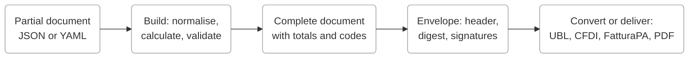

This page is written for coding agents and for the people who direct them. GOBL is small enough to hold in your head, but a handful of its conventions are easy to get wrong when you have only seen XML invoices before. Every rule below was checked against the current GOBL release, and the surprising ones say why they are surprising.

<Note>
**If you are an AI agent:** read this page in full, then fetch [docs.gobl.org/AGENTS.md](https://docs.gobl.org/AGENTS.md), a condensed version to keep in context. Both are plain Markdown. Every other page on this site is available as Markdown by adding `.md` to its URL, and [docs.gobl.org/llms.txt](https://docs.gobl.org/llms.txt) lists them all. If you are integrating with the Invopop platform, which uses GOBL as its document format, read [docs.invopop.com/llms.md](https://docs.invopop.com/llms.md) as well.
</Note>

## The model in one minute

A GOBL **document** is a JSON object whose `$schema` says what it is: an invoice, a party, an order. You write only the raw facts. **Build** normalises the data, calculates every derived value using the tax rules of the document's **regime** (a country) and any **addons** (a local format such as VERI\*FACTU or CFDI), and validates the result. The complete document can then be wrapped in an **envelope**, which adds a header with a UUID and a digest, and be signed. Conversion tools turn the envelope into whatever a tax authority or network wants.

<Frame>

</Frame>

Nine words carry most of the meaning.

| Word | What it is | Where it shows up |
| ---- | ---------- | ----------------- |
| **Document** | The business object. Its `$schema` names the type, for example `https://gobl.org/draft-0/bill/invoice`. | Everything you write |
| **Build** | Normalise, calculate and validate. Fills in `$regime`, `type`, `currency`, `uuid`, tax percentages, line sums and `totals`. | CLI `gobl build`, API `POST /build`, MCP `build` |
| **Envelope** | `head` (UUID, digest, stamps, tags) + `doc` + `sigs`. The unit that is signed and exchanged. | `$schema` `https://gobl.org/draft-0/envelope` |
| **Regime** | A country's tax rules: categories, rate keys and percentages by date, tags, correction types, validation. | `$regime`, pages under `/regimes/` |
| **Addon** | Rules for one local format or reporting system, layered on the regime. | `$addons`, pages under `/addons/` |
| **Extension** | A coded value an addon or regime requires, taken from an official code list. | `ext` maps on documents, lines, taxes and parties |
| **Tag** | A scenario switch that changes how a regime reads the document. | `$tags`, for example `simplified` or `reverse-charge` |
| **Key** | A lowercase, hyphenated identifier for a concept: `standard`, `credit-note`, `reverse-charge`. | `rate`, `key`, `type`, tags |
| **Code** | An identifier from the outside world, kept as given: `VAT`, `B98602642`, `SAMPLE-001`. | `cat`, `tax_id.code`, `series`, `code` |

## Reading these docs as an agent

- **Any page as Markdown**: append `.md`, for example [/draft-0/bill/invoice.md](https://docs.gobl.org/draft-0/bill/invoice.md).
- **Index of every page**: [/llms.txt](https://docs.gobl.org/llms.txt).
- **Condensed rules**: [/AGENTS.md](https://docs.gobl.org/AGENTS.md). Paste it into your project's own agent instructions.
- **Install the docs as a skill**: `npx skills add https://docs.gobl.org` adds [/skill.md](https://docs.gobl.org/skill.md) to agents that follow the agent skills specification.
- **MCP**: the hosted server at `https://gobl.dev/v0/mcp` or the local `gobl mcp` give an agent `build`, `validate`, `correct`, `replicate`, `schema`, `regime`, `regime_list`, `addon` and `addon_list` tools. Setup for Claude, Cursor and Claude Code is on the [MCP page](/api/mcp).

Three kinds of generated page answer most questions, and they all have the same shape.

| Page | URL | What to read |
| ---- | --- | ------------ |
| Schema | `/draft-0/<package>/<type>`, for example [bill/invoice](/draft-0/bill/invoice) | **Properties** lists every field with its type. **Validation Rules** lists each rule with its code. Fields marked **calculated** are filled by build; never write them. |
| Regime | `/regimes/<code>`, for example [es](/regimes/es) | **Tax Categories** with the rate keys and percentages you may use. **Correction Definitions** for the allowed correction types. **Scenarios** for the tags the regime recognises and what they change. |
| Addon | `/addons/<key>`, for example [es-verifactu-v1](/addons/es-verifactu-v1) | **Extensions** with the exact code values each key accepts. **Scenarios** for what build fills in automatically. **Validation Rules** for what will fail. |

## Tooling that validates for you

Never hand-check a GOBL document. Build it with one of these and read the faults.

<Tabs>
  <Tab title="Public API (no install)">
    ```bash
    curl -s -X POST https://gobl.dev/v0/build \
      -H "Content-Type: application/json" \
      -d '{"data": {"$schema": "https://gobl.org/draft-0/bill/invoice", "...": "..."}}'
    ```

    The response mirrors the request: `{"data": <built document>}`. Add `"envelop": true` for an envelope. Errors come back as `{"key": "validation", "faults": [{"code", "paths", "message"}]}`. `GET /v0/regimes/ES` and `GET /v0/addons/es-verifactu-v1` return the same definitions the docs are generated from. No authentication, free to use, see the [API reference](/api/introduction).
  </Tab>
  <Tab title="CLI">
    The CLI is built from [gobl.dev](https://github.com/invopop/gobl.dev), which bundles the core library with every addon.

    ```bash
    go install github.com/invopop/gobl.dev/cmd/gobl@latest
    gobl build -i invoice.json            # calculate, validate, print
    gobl build -i -e invoice.json         # the same, wrapped in an envelope
    gobl build -i --set series=A invoice.yaml   # YAML input, override a field
    gobl correct -i --credit built.json   # draft a credit note
    gobl keygen && gobl sign -i built.json      # sign with a local key
    gobl verify signed.json               # check digest and signatures
    gobl validate built.json              # validate a complete document only
    ```

    Prebuilt binaries are on the [releases page](https://github.com/invopop/gobl.dev/releases). The [CLI quick start](/quick-start/cli) walks through the message and signing example.
  </Tab>
  <Tab title="MCP">
    ```bash
    claude mcp add gobl --transport http https://gobl.dev/v0/mcp
    ```

    Use `regime` and `addon` before writing a document to learn the exact rate keys, tags and extension codes a country expects, then `build` to validate. See the [MCP page](/api/mcp) for Claude Desktop and Cursor configuration and the full tool list.
  </Tab>
  <Tab title="Go">
    ```go
    inv := &bill.Invoice{ /* raw facts only */ }
    env := gobl.NewEnvelope()
    if err := env.Insert(inv); err != nil { /* calculation error */ }
    if err := env.Validate(); err != nil { /* validation faults */ }
    ```

    `Insert` runs the calculation; call `env.Validate()` afterwards to get the same faults the CLI reports. The [GOBL README](https://github.com/invopop/gobl#usage) has the complete example. Import the addon modules you need, or the [gobl.dev bundle](https://github.com/invopop/gobl.dev), so their rules run.
  </Tab>
  <Tab title="Other">
    [build.gobl.org](https://build.gobl.org) is a browser editor with the same build behaviour. [gobl.ruby](https://github.com/invopop/gobl.ruby) offers typed Ruby classes with build, validate and sign through the CLI. [gobl.ts](https://github.com/invopop/gobl.ts) provides TypeScript types. The [tools page](/overview/tools) lists the conversion libraries for UBL, CII, CFDI, FatturaPA, Facturae and more.
  </Tab>
</Tabs>

## GOBL in twelve rules

Checked against GOBL `v0.504.0` through gobl.dev `v0.500.15`.

### 1. Send the minimum and let build do the maths

You provide the facts, build provides everything derived. Never write `sum`, `total`, `totals`, tax `percent`, `currency` or `uuid` yourself. If you do send `totals`, they are recalculated and silently replaced, so a wrong figure will not raise an error.

<CodeGroup>
```json What you send
{
  "$schema": "https://gobl.org/draft-0/bill/invoice",
  "$regime": "ES",
  "series": "SAMPLE",
  "code": "001",
  "issue_date": "2026-09-03",
  "supplier": {
    "name": "Provider One S.L.",
    "tax_id": { "country": "ES", "code": "B98602642" }
  },
  "customer": {
    "name": "Sample Consumer S.L.",
    "tax_id": { "country": "ES", "code": "B63272603" }
  },
  "lines": [
    {
      "quantity": "10",
      "item": { "name": "Development services", "price": "100.00" },
      "discounts": [{ "percent": "10%" }],
      "taxes": [{ "cat": "VAT", "rate": "standard" }]
    }
  ]
}
```

```json What build returns
{
  "$schema": "https://gobl.org/draft-0/bill/invoice",
  "$regime": "ES",
  "type": "standard",
  "series": "SAMPLE",
  "code": "001",
  "issue_date": "2026-09-03",
  "currency": "EUR",
  "supplier": {
    "name": "Provider One S.L.",
    "tax_id": { "country": "ES", "code": "B98602642" }
  },
  "customer": {
    "name": "Sample Consumer S.L.",
    "tax_id": { "country": "ES", "code": "B63272603" }
  },
  "lines": [
    {
      "i": 1,
      "quantity": "10",
      "item": { "name": "Development services", "price": "100.00" },
      "sum": "1000.00",
      "discounts": [{ "percent": "10%", "amount": "100.00" }],
      "taxes": [
        { "cat": "VAT", "key": "standard", "rate": "general", "percent": "21.0%" }
      ],
      "total": "900.00"
    }
  ],
  "totals": {
    "sum": "900.00",
    "total": "900.00",
    "taxes": {
      "categories": [
        {
          "code": "VAT",
          "rates": [
            { "key": "standard", "base": "900.00", "percent": "21.0%", "amount": "189.00" }
          ],
          "amount": "189.00"
        }
      ],
      "sum": "189.00"
    },
    "tax": "189.00",
    "total_with_tax": "1089.00",
    "payable": "1089.00"
  }
}
```
</CodeGroup>

Building an already-built document returns it unchanged, so build is safe to repeat.

<Warning>
`validate` is not `build`. It checks a complete document and does not calculate anything, so running it on your partial input fails with tax and totals errors. Build first, validate the output if you need to.
</Warning>

### 2. Numbers are strings, and percentages need the sign

Amounts and percentages are decimal strings: `"100.00"`, `"10%"`, `"21.0%"`. Trailing zeros are significant and set the precision, see [numbers](/overview/numbers) and [rounding](/overview/rounding). JSON numbers are accepted on input and come back as strings.

<Warning>
A percentage without the `%` sign is read as a factor, so `"percent": "21"` becomes **`2100%`** and build succeeds. Always write `"21%"` or `"21.0%"`.
</Warning>

### 3. `$schema` says what the document is

Every document needs a `$schema`. The envelope has its own (`https://gobl.org/draft-0/envelope`) and carries the document's inside `doc`. A document without `$schema` is rejected as `unknown-schema`.

| Schema | Use |
| ------ | --- |
| `bill/invoice` | Invoices, credit notes, debit notes, corrective invoices, proformas |
| `bill/order`, `bill/delivery`, `bill/payment`, `bill/status` | Orders, delivery notes, payment receipts and lifecycle events |
| `org/party`, `org/item` | A company or person, and a catalogue product, stored on their own |
| `note/message` | A minimal document, handy for testing signatures |

All schema URLs start with `https://gobl.org/draft-0/`. The [schema index](/draft-0) lists every type, including the small ones such as `tax/combo`, `org/address` and `pay/terms` that appear inside the big ones.

### 4. The regime decides the rules

`$regime` is the country whose tax rules apply, normally the supplier's. Build infers it from `supplier.tax_id.country` when it is missing, but set it explicitly: if neither is present, the failure is the unhelpful `currency: missing or invalid`. When `$regime` and the supplier's country disagree, `$regime` wins.

Regimes exist for `AE`, `AR`, `AT`, `BE`, `BR`, `CA`, `CH`, `CO`, `DE`, `DK`, `EL` (Greece), `ES`, `FI`, `FR`, `GB`, `IE`, `IN`, `IT`, `MX`, `NL`, `NO`, `PL`, `PT`, `SA`, `SE`, `SG` and `US`. Greece's tax code is `EL` while its address country is `GR`; build normalises a `GR` tax identity to `EL` for you. A supplier from a country without a regime has no defaults to fall back on, so you must set `currency` and give every tax an explicit `percent`.

### 5. Taxes are keys, not numbers

A line tax is a category code plus a rate key, and build resolves the percentage for the regime and the `issue_date`. The same Spanish document dated 2012 gets 18%, because that was the rate then.

| You write | Build returns | Meaning |
| --------- | ------------- | ------- |
| `{"cat":"VAT","rate":"standard"}` | `key: standard, rate: general, percent: 21.0%` | The default rate. `standard` and `general` name the same thing |
| `{"cat":"VAT","rate":"reduced"}` | `key: standard, rate: reduced, percent: 10.0%` | A reduced rate defined by the regime |
| `{"cat":"VAT","rate":"zero"}` | `key: zero, percent: 0%` | Zero-rated |
| `{"cat":"VAT","key":"exempt"}` | `key: exempt`, no percent | Exempt; addons usually want an extension saying why |
| `{"cat":"VAT","key":"reverse-charge"}` | `key: reverse-charge`, no percent | The customer accounts for the tax |
| `{"cat":"VAT","percent":"21%"}` | `key: standard, percent: 21%` | Explicit percentage, for regimes without rates |
| `{"cat":"VAT","rate":"bogus"}` | `'bogus' rate not defined for key 'standard'` | Unknown keys fail the build |

Category codes are regime specific: `VAT` in Europe, `ST` in the US, `IVA` in Mexico, `GST` in Singapore, and Spain also has `IGIC`, `IPSI`, `IRPF` and `IRNR`. Read them off the regime page or the MCP `regime` tool. Two behaviours worth knowing: a retained tax such as Spanish `IRPF` reduces `totals.payable` below `totals.total_with_tax`, and setting `tax.prices_include` to a category treats line prices as tax-inclusive and extracts the tax from them.

### 6. Keys are lowercase, codes are as given

Everything GOBL defines is a **key**: lowercase, hyphenated, such as `standard`, `credit-note`, `reverse-charge`, `credit-transfer`. Everything that comes from the outside world is a **code**, kept as it is: `VAT`, `IRPF`, `B98602642`, `SAMPLE`. Writing `"cat": "vat"` fails with `invalid-category: 'vat' not defined in regime`, and `"rate": "Standard"` fails the same way. Keys instead of numeric codes is the whole point of the format, so when you meet a code such as UNTDID `30`, look for the key (`credit-transfer`) rather than copying the number.

### 7. Addons switch on a local format

`$addons` lists the formats or reporting systems the document must satisfy: `["es-verifactu-v1"]` for VERI\*FACTU, `["mx-cfdi-v4"]` for CFDI, `["eu-en16931-v2017"]` for the European norm. An addon adds **extensions**, coded values under `ext` on the document, its lines, its taxes or its parties. Build fills in the defaults it can work out: the VERI\*FACTU addon alone turns a plain invoice into one carrying `es-verifactu-doc-type: F1` and per-tax `es-verifactu-op-class` and `es-verifactu-regime` codes. Anything it cannot infer comes back as a validation fault naming the extension key.

The available addons are `ar-arca-v4`, `br-nfe-v4`, `br-nfse-v1`, `co-dian-v2`, `de-xrechnung-v3`, `de-zugferd-v2`, `dk-oioubl-v2`, `es-facturae-v3`, `es-sii-v1`, `es-tbai-v1`, `es-verifactu-v1`, `eu-en16931-v2017`, `fi-finvoice-v3`, `fr-choruspro-v1`, `fr-ctc-flow2-v1`, `fr-ctc-flow6-v1`, `fr-ctc-flow10-v1`, `fr-facturx-v1`, `gr-mydata-v1`, `it-sdi-v1`, `it-ticket-v1`, `mx-cfdi-v4`, `pl-favat-v3`, `pt-saft-v1` and `sa-zatca-v1`. Each has a page under [/addons](/addons/overview) whose **Extensions** section is the only reliable source for code values.

<Tip>
Never invent an extension value. Copy it from the addon page, the MCP `addon` tool, or `GET https://gobl.dev/v0/addons/<key>`.
</Tip>

### 8. Tags name scenarios, and only known tags are allowed

`$tags` switches on scenarios the regime or addon defines. `simplified` marks an invoice without customer details, `reverse-charge` the customer-accounts-for-VAT case, `self-billed` a buyer-issued invoice; regimes add their own, such as `customer-rates`, `cash-basis`, `second-hand-goods` or `travel-agency`. A tag nobody defines fails the build with `$tags: 'bogus-tag' undefined`. Scenarios can add legal notes under `tax.notes` and set extensions: under VERI\*FACTU, omitting the customer fails with `GOBL-ES-VERIFACTU-BILL-INVOICE-06 customer is required` unless you add `"$tags": ["simplified"]`, which also sets the document type to `F2`. Older examples put tags under `tax.tags`; build moves them to `$tags`.

### 9. Dates are `YYYY-MM-DD`

`issue_date`, due dates and periods are plain ISO dates: `"2026-09-03"`. Any other format is an input error before validation even starts. `issue_date` defaults to today, and rates are resolved for that date, so set it explicitly when you replay historical documents.

### 10. Identities are normalised and checked

`series` plus `code` is the document number. Both may be empty at build time, but `code` is required to sign, and most issuing systems assign it just before signing. A `tax_id` has a `country` and a `code`; build strips prefixes and punctuation, so `ESB23103039` and `es-b-986.026.42` become `B23103039` and `B98602642`, then validates format and checksum with codes such as `GOBL-GB-TAX-IDENTITY-03`. Use real, valid identities when testing. Other identifiers of a party, such as a registration number or a Peppol participant ID, go in `identities`, not `tax_id`.

### 11. Never edit an issued invoice, correct it

Corrections are new documents whose `type` is `credit-note` (a refund that extends the original), `debit-note` (extra charges) or `corrective` (a full replacement), with the original referenced in `preceding`. Amounts on a credit note are positive; the type carries the sign. Which types a regime accepts is on its page under **Correction Definitions**: Spain accepts all three and maps them onto its rectifying invoices, the United Kingdom accepts `credit-note` only.

Do not assemble corrections by hand. `gobl correct -i --credit invoice.json`, `POST /v0/correct` or the MCP `correct` tool copies the lines and builds `preceding` with the original's `uuid`, `series`, `code` and `issue_date`, and adds whatever the regime or addon requires. Pass `--options` (or `"schema": true` over MCP) to see the correction options a document allows: `type`, `series`, `issue_date`, `reason`, `copy_tax`, `stamps` and, for some addons, extension codes.

### 12. The envelope is sealed by its digest

`gobl build -e` wraps the document in an envelope with `head.uuid`, a `head.dig` SHA-256 digest of the canonical document, and a `uuid` inside the document as well; the two UUIDs differ. `gobl sign` signs the header with an ES256 key from `gobl keygen`, and `gobl verify` checks both. Changing a single character of a signed or enveloped document without rebuilding fails with `GOBL-ENVELOPE-11 envelope digest does not match document contents`. Treat a signed envelope as read-only and correct it instead. Stamps from authorities live in `head.stamps`; free-form data goes in `meta`.

## Your first document in five commands

<Steps>
  <Step title="Write the facts">
    Save the "What you send" example from rule 1 as `invoice.json`, or write it as YAML. Leave out everything build calculates.
  </Step>
  <Step title="Build it">
    ```bash
    gobl build -i invoice.json
    ```

    Compare the output with the "What build returns" block. Fix any `faults` by their `code` and `paths`, then rebuild.
  </Step>
  <Step title="Ask for a credit note">
    ```bash
    gobl build invoice.json > built.json
    gobl correct -i --credit built.json
    ```

    The result has `type: credit-note`, the same series, and a `preceding` block naming the original.
  </Step>
  <Step title="Sign it">
    ```bash
    gobl keygen                 # once, creates ~/.gobl/id_es256.jwk
    gobl sign -i built.json > signed.json
    ```

    The output is an envelope with one entry in `sigs`. Signing requires a `code` on the document.
  </Step>
  <Step title="Verify it">
    ```bash
    gobl verify signed.json && echo ok
    ```

    Edit a value in `signed.json` and run `verify` again to see `GOBL-ENVELOPE-11`.
  </Step>
</Steps>

The [invoices quick start](/quick-start/invoices) does the same with YAML and adds a PDF preview.

## Prompts to copy

Each card copies a complete prompt for your coding agent. They point the agent at the Markdown sources above so it works from current documentation rather than memory.

<Prompt description="Turn your own invoice data into a valid GOBL document and prove it builds." icon="file-invoice" actions={["copy", "cursor"]}>
Convert my invoice data into a GOBL bill/invoice document. First read https://docs.gobl.org/llms.md in full, then the schema at https://docs.gobl.org/draft-0/bill/invoice.md and the regime page for the supplier's country at https://docs.gobl.org/regimes/ followed by the lowercase country code and .md. Write the minimal document: $schema, $regime, series, issue_date in YYYY-MM-DD form, supplier and customer with tax_id objects, and lines with quantity, item name and price as strings and taxes expressed as an uppercase category code plus a lowercase rate key. Do not write sums, totals, currency, uuid or tax percentages, and if you must write a percentage include the percent sign. If I name a local format, add its key to $addons and read its page under https://docs.gobl.org/addons/ for the extension codes. Then build the document by posting it wrapped in a data property to https://gobl.dev/v0/build, or with gobl build if the CLI is installed, or with the build tool of the GOBL MCP server. If it fails, read each fault's code and paths, look the code up on the schema page, fix the document and try again. Show me the built result and explain every field you were unsure about.
</Prompt>

<Prompt description="Find out what a country requires before writing a single document." icon="landmark" actions={["copy", "cursor"]}>
I need to issue invoices in the country I name. Read https://docs.gobl.org/llms.md, then the regime page at https://docs.gobl.org/regimes/ followed by the lowercase tax country code and .md, and the page of every addon whose key starts with that country code under https://docs.gobl.org/addons/. Summarise for me: the tax categories and the rate keys with their current percentages, the tags the regime defines and what each one changes, the correction types allowed, the extensions each addon requires and where their code values come from, and the validation rules most likely to fail for a first-time user. Then write one minimal invoice for that country that satisfies the regime and the most relevant addon, build it with https://gobl.dev/v0/build or the gobl CLI, and show me the built output.
</Prompt>

<Prompt description="Correct an issued invoice the right way." icon="eraser" actions={["copy", "cursor"]}>
I have a built GOBL invoice and need to correct it. Read rule 11 in https://docs.gobl.org/llms.md and the Correction Definitions section of the regime page for the document's $regime under https://docs.gobl.org/regimes/. Tell me which correction types this regime allows and which one fits my situation: a refund or partial refund, extra charges, or replacing the original because a key detail was wrong. Then produce the corrective document with gobl correct, POST https://gobl.dev/v0/correct or the correct tool of the GOBL MCP server, using the options schema to supply any required reason or extension codes. Never assemble the preceding block by hand. Show me the built result and point out how the preceding block references the original.
</Prompt>

<Prompt description="Explain a GOBL validation error and fix the document." icon="bug" actions={["copy", "cursor"]}>
A GOBL build failed and I will paste the error. For each fault, use its code to find the rule: codes shaped like GOBL-BILL-INVOICE-NN are on https://docs.gobl.org/draft-0/bill/invoice.md under Validation Rules, codes containing a country code such as GOBL-ES-TAX-IDENTITY-NN are on the regime page, and codes containing an addon key such as GOBL-ES-VERIFACTU-BILL-INVOICE-NN are on the addon page under https://docs.gobl.org/addons/. Explain in plain language what each rule requires and why my document fails it, referring to the JSON paths in the fault. Then propose the smallest change to the document that satisfies every rule at once, apply it, rebuild with https://gobl.dev/v0/build or the gobl CLI, and confirm the result is clean.
</Prompt>

<Prompt description="Set this project up to work with GOBL." icon="rocket" actions={["copy", "cursor"]}>
Add GOBL support to this project. Read https://docs.gobl.org/llms.md and https://docs.gobl.org/AGENTS.md, then add the GOBL MCP server https://gobl.dev/v0/mcp to this project's agent configuration if it supports MCP, and copy the rules from AGENTS.md into this project's own agent instructions file under a heading that says they are the GOBL rules. If this is a Go project, add github.com/invopop/gobl and show me how to build an invoice with gobl.NewEnvelope and Insert. Otherwise, write a small client for POST https://gobl.dev/v0/build that wraps a document in a data property and turns the faults array into typed errors, and install the gobl CLI from github.com/invopop/gobl.dev for local checks. Finish with a test that builds the example invoice from https://docs.gobl.org/llms.md and asserts the payable total.
</Prompt>

## Where to look

| To find out | Read |
| ----------- | ---- |
| Which fields a document has, which are calculated, and how each is validated | `https://docs.gobl.org/draft-0/<package>/<type>.md`, for example `bill/invoice`, `org/party`, `tax/combo`, `pay/terms` |
| The tax categories, rate keys, percentages, tags and correction types of a country | `https://docs.gobl.org/regimes/<code>.md` |
| The extension codes and scenarios of a local format | `https://docs.gobl.org/addons/<key>.md` |
| Shared code lists such as UNTDID or ISO | `https://docs.gobl.org/catalogues/<key>.md` |
| How validation is layered and what a fault code means | [Validation rules](/overview/validation) |
| Why amounts are strings and how rounding works | [Numbers](/overview/numbers), [Rounding](/overview/rounding) |
| How the envelope digest is computed | [Canonicalization](/overview/canonicalization), [Envelope](/draft-0/envelope) |
| Building and signing from the command line | [CLI](/quick-start/cli), [Invoices](/quick-start/invoices) |
| The REST API and MCP server | [API](/api/introduction), [MCP](/api/mcp) |
| Sending GOBL documents to tax authorities and networks | [Invopop docs for agents](https://docs.invopop.com/llms.md) |

## Vocabulary map

| If you are thinking | GOBL says |
| ------------------- | --------- |
| Invoice number | `series` + `code` |
| VAT number, tax ID, NIF, RFC | `tax_id` with `country` and `code` |
| Company registration number, Peppol ID, GLN | an entry in `identities` |
| 21% VAT | `{"cat": "VAT", "rate": "standard"}` resolved for regime and date |
| Tax-inclusive prices | `tax.prices_include: "VAT"` |
| Withholding, retention | a second tax combo such as `{"cat": "IRPF", "percent": "15%"}`; see `totals.retained_tax` |
| Refund, credit | `type: credit-note` with `preceding`, made with `gobl correct --credit` |
| Replace a wrong invoice | `type: corrective`, where the regime allows it |
| B2C receipt without customer details | `$tags: ["simplified"]`, customer omitted |
| Reverse charge | `$tags: ["reverse-charge"]` and tax `key: reverse-charge` |
| Country format, e-invoicing standard | an addon in `$addons` plus its `ext` codes |
| Bank transfer, card, direct debit | `payment.instructions.key`: `credit-transfer`, `card`, `direct-debit` |
| Due in 30 days | `payment.terms` with `key: due-date` and `due_dates` |
| Hash, signature, seal | `head.dig`, `sigs`, `head.stamps` on the envelope |
| Custom data | `meta` |
