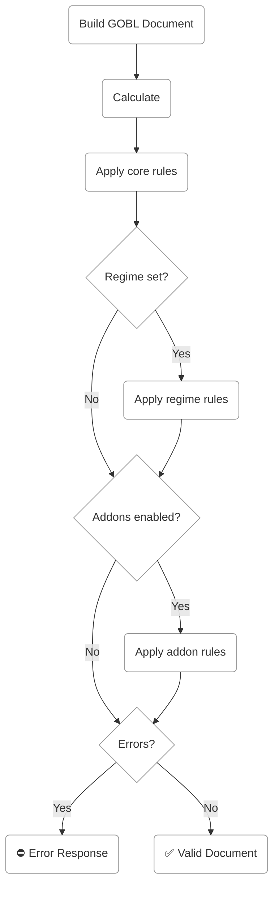

GOBL validates every document automatically as part of the build process. These validation rules check that documents have the right fields, follow the expected formats, and satisfy whatever constraints the relevant [schema](/draft-0), [tax regime](/regimes/overview) and [addons](/addons/overview) define.

## How it works

When you build a GOBL document, it's processed through a validation rules engine that checks each struct in a document against a set of assertions. Every assertion has three parts:

- A unique validation code that identifies the rule.
- One or more tests that evaluate to true or false.
- A human-readable message that surfaces when a test fails.

When GOBL processes a document, it runs all applicable rules and collects any failures into a structured error response, including the field path, validation code, and message for each failure.

<Frame>

</Frame>

## Three layers of rules

Rules are organized into three layers, applied in order:

### Core rules

Core rules apply to every GOBL document, regardless of country or configuration. They enforce the basic structure each document type requires. An [invoice](/draft-0/bill/invoice), for example, always needs a [`type`](/draft-0/bill/invoice#type), [`issue_date`](/draft-0/bill/invoice#issuedate), [`currency`](/draft-0/bill/invoice#currency), and [`supplier`](/draft-0/bill/invoice#supplier).

Core rules live alongside the structs they validate in the GOBL source, and are listed under the **Validation Rules** section on each [schema's reference page](/draft-0).

### Regime rules

[Tax regimes](/regimes/overview) add country-specific requirements on top of core rules. When a document specifies a regime — [Portugal](/regimes/pt), [Mexico](/regimes/mx), [France](/regimes/fr), and so on — that regime's rules are also evaluated.

A Portuguese rule might require invoices to include a specific extension, or that the series code follows a particular format. These rules only kick in when the document's regime is set to Portugal.

### Addon rules

[Addons](/addons/overview) layer further validation on top of regime rules. When a document has an addon enabled such as [Mexico CFDI](/addons/mx-cfdi-v4) or Peppol's [EU EN 16931](/addons/eu-en16931-v2017), its rules are checked as well.

Addon rules typically enforce the requirements of a specific standard or reporting system. The [Mexico CFDI](/addons/mx-cfdi-v4) addon, for instance, requires certain [tax extensions](/draft-0/tax/extensions) and [customer](/draft-0/org/party) fields depending on whether the invoice is global or domestic.

---

## Validation codes

Every assertion gets a unique code built from the package, struct, and a sequence number:

- `GOBL-BILL-INVOICE-01` — core rule on [`bill.Invoice`](/draft-0/bill/invoice)
- `GOBL-PT-SAFT-V1-BILL-INVOICE-04` — [Portugal SAF-T](/addons/pt-saft-v1) addon rule on [`bill.Invoice`](/draft-0/bill/invoice)
- `GOBL-MX-CFDI-V4-BILL-INVOICE-01` — [Mexico CFDI](/addons/mx-cfdi-v4) addon rule on [`bill.Invoice`](/draft-0/bill/invoice)

These codes show up in error responses and can be used to programmatically identify and handle specific validation failures.

## Error collection

Validation never stops at the first failure. The engine runs every applicable rule across all three layers — and collects every fault it finds. The full list of errors is returned together in a single response, so you can see and fix all problems at once rather than going through them one at a time.

## Calculated fields

Some fields are marked as **calculated** in the validation tables. These fields are automatically populated by GOBL during the build step, *before* validation runs. For example, an [invoice's](/draft-0/bill/invoice) [`totals`](/draft-0/bill/invoice#totals) are computed from the line items, taxes, and discounts — you never need to provide them yourself.

A validation rule that requires a calculated field to be present does not mean you must supply it as input. GOBL will fill it in during calculation, and validation will then confirm the result is correct.

In the validation tables, calculated fields are labeled with **calculated** beneath the field name.